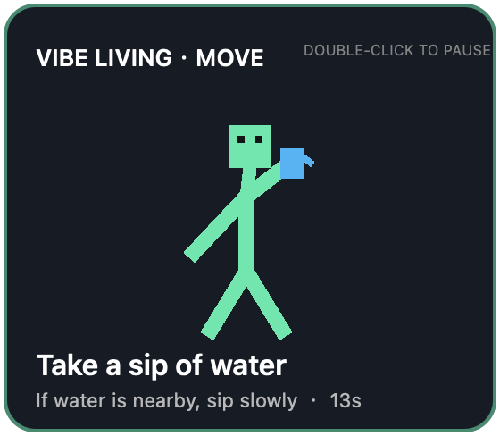

# Vibe Living

**Move while your coding agent works.**

Vibe Living is a small, local movement companion for the waiting moments in AI-assisted development. When Codex or Claude Code is working and does not need your input, a pixel-style figure demonstrates a gentle desk-friendly movement. It steps aside for approvals and questions, then disappears when the turn ends.




Chinese systems automatically use Simplified Chinese:


[简体中文](README.zh-CN.md)

> Status: early macOS release. Apple silicon is supported with a bundled native helper. Other Mac architectures build the helper locally on first use.

## Why Vibe Living?

Vibe Coding changes how we spend development time: less continuous typing, more short waits while an agent reasons or runs tools. Vibe Living uses those existing pauses as invitations to stand, stretch, or gently change position—without claiming to diagnose, treat, or prevent health conditions.

## Features

- Appears after the agent has worked for six seconds.
- Rotates through small shoulder rolls, fixed-hip seated torso turns with naturally bent arms, relaxed wrist-and-finger motions, quiet posture changes, and hydration reminders.
- Keeps every movement quiet, low-amplitude, equipment-free, and within one person's desk space.
- Automatically displays Simplified Chinese or English from the macOS preferred language, with English as the fallback.
- Hides when the agent needs permission or user input.
- Supports concurrent agent sessions without opening duplicate windows.
- Double-click to pause prompts for ten minutes.
- Respects the macOS Reduce Motion setting.
- Runs locally with no telemetry, network requests, or source-code access.
- Shares one hook implementation across Codex and Claude Code.

## Requirements

- macOS 13 or newer
- Apple silicon for the bundled binary; Intel Macs require Xcode Command Line Tools
- Codex/ChatGPT desktop with plugin lifecycle hooks and the `codex plugin` command, or Claude Code with plugin hooks
- An internet connection for the initial download and updates

## Install

### Codex / ChatGPT desktop

Run these commands in Terminal:

```bash
codex plugin marketplace add cheka/vibe-living
codex plugin add vibe-living@vibe-living
```

Then:

1. Restart the desktop app.
2. Confirm that **Vibe Living** is enabled in the plugin list, and review and trust its lifecycle hooks if prompted.
3. Start a new task and let the agent work for at least six seconds. The movement companion should appear while the agent is working, hide when an approval or answer is needed, and disappear when the turn ends.

Vibe Living starts automatically through lifecycle hooks; there is no command to run inside a task.

### Update

Refresh the marketplace, then reinstall the plugin so the latest packaged version is used:

```bash
codex plugin marketplace upgrade vibe-living
codex plugin remove vibe-living@vibe-living
codex plugin add vibe-living@vibe-living
```

Restart the desktop app after updating.

### Uninstall

```bash
codex plugin remove vibe-living@vibe-living
codex plugin marketplace remove vibe-living
```

The second command also removes the Vibe Living marketplace source.

## Try with Claude Code

The repository is not yet a persistent Claude Code marketplace. To load Vibe Living for one Claude Code session:

```bash
git clone https://github.com/cheka/vibe-living.git
cd vibe-living
claude --plugin-dir "$PWD/plugins/vibe-living"
```

Inside that session, open `/hooks` to review the registered lifecycle hooks. Closing the session unloads the plugin; the clone remains on disk.

## Troubleshooting

- **`codex plugin` is unavailable:** update to a Codex/ChatGPT desktop release that supports plugin lifecycle hooks.
- **Nothing appears:** start a new task and let the agent work uninterrupted for at least six seconds. The overlay is intentionally hidden while the agent is waiting for you and after the turn finishes.
- **Intel Mac does not start the overlay:** install Xcode Command Line Tools with `xcode-select --install`, then start a new task. The native helper is built locally on first use.
- **Hooks are disabled:** enable Vibe Living in the plugin list and approve its lifecycle hooks. Hook failures never block the agent, so a disabled or failed hook may otherwise be silent.

## Local development

Clone the repository, register that checkout as a local marketplace, and install from it:

```bash
git clone https://github.com/cheka/vibe-living.git
cd vibe-living
codex plugin marketplace add "$PWD"
codex plugin add vibe-living@vibe-living
```

## Development

```bash
make check       # manifests, Python, shell, tests, and Swift type-check
make harness     # simulate the complete Hook lifecycle in isolation
make build       # build the native helper for the current Mac architecture
make preview     # render the overlay preview
make package     # create a distributable archive under dist/
```

Every new requirement must update its relevant specification and acceptance criteria under `docs/specs/` before implementation begins. See [Specifications](docs/specs/README.md), [Development](docs/development.md), [Architecture](docs/architecture.md), and [Contributing](CONTRIBUTING.md).

## Privacy and safety

Vibe Living reads only lifecycle metadata needed to distinguish local sessions. It does not read repository files, prompts, or model responses, and it performs no network requests.

The default catalog excludes jumping, marching in place, deep squats, fast arm swings, and movements that occupy a shared walkway. Hydration prompts apply only when water is already within reach.

The movements are general activity prompts, not medical advice. Stay within a comfortable range and stop if you feel pain, dizziness, numbness, shortness of breath, or unusual discomfort. Consult a qualified professional if you have health concerns or movement restrictions.

## License

[MIT](LICENSE)
