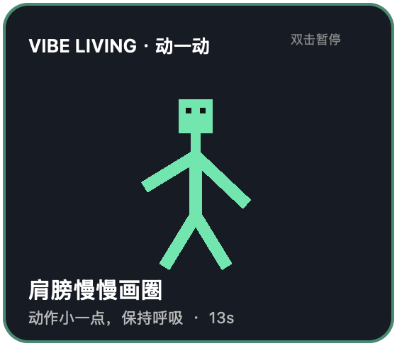
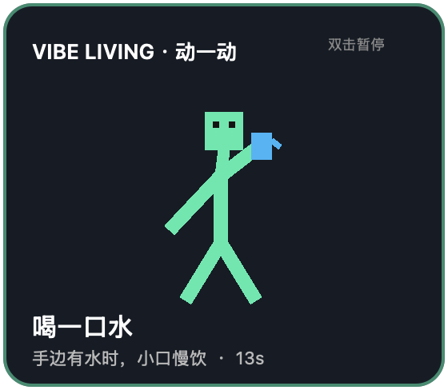
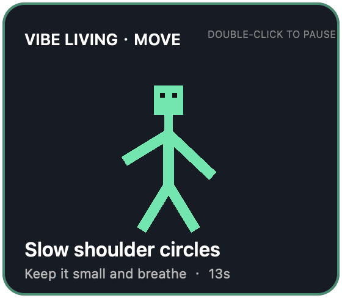

# Vibe Living

**让 AI 写代码，也让自己动一动。**

Vibe Living 是一个面向 AI 编程等待时间的本地微运动伙伴。当 Codex 或 Claude Code 正在思考、执行工具且不需要输入时，它会显示一个像素风小人，示范简单的桌边动作；需要审批或回答时自动收起，任务结束后消失。





英文系统会自动显示英文界面：



[English](README.md)

> 当前为 macOS 早期版本。Apple 芯片直接使用随插件提供的原生程序；其他 Mac 架构会在首次使用时通过 Xcode Command Line Tools 构建。

## 为什么叫 Vibe Living？

Vibe Coding 改变了开发者使用时间的方式：连续输入减少，等待 Agent 思考和执行的碎片时间增加。Vibe Living 希望把这些已经存在的间隙变成站立、伸展和改变姿势的轻量提示，同时不对健康效果作诊断、治疗或预防承诺。

## 功能

- Agent 连续工作 6 秒后出现。
- 轮换小幅肩部画圈、坐姿转体、手腕放松、安静起身和喝水提醒。
- 所有动作限定在个人工位范围内，安静、低幅度、无需器械。
- 根据 macOS 首选语言自动显示简体中文或英文；非中文环境回退英文。
- Agent 需要权限或用户输入时自动收起。
- 支持多个并行任务，不重复启动悬浮窗。
- 双击暂停 10 分钟。
- 遵循 macOS“减少动态效果”设置。
- 完全本地运行：无遥测、无网络请求、不读取代码。
- 同一套 Hooks 同时兼容 Codex 与 Claude Code。

## 环境要求

- macOS 13 或更高版本
- Apple 芯片可直接运行；Intel Mac 需要 Xcode Command Line Tools
- 支持插件生命周期 Hooks 的 Codex/ChatGPT 桌面端，或 Claude Code

## Codex 安装

仓库发布后，将 `<github-owner>` 替换为 GitHub 仓库所有者：

```bash
codex plugin marketplace add <github-owner>/vibe-living
codex plugin add vibe-living@vibe-living
```

重启桌面应用，启用 **Vibe Living**，检查并信任 Hooks，然后新建任务。

本地开发安装：

```bash
codex plugin marketplace add /absolute/path/to/vibe-living
codex plugin add vibe-living@vibe-living
```

## Claude Code 试用

```bash
git clone https://github.com/<github-owner>/vibe-living.git
claude --plugin-dir ./vibe-living/plugins/vibe-living
```

使用 `/hooks` 检查插件 Hooks。

## 开发

```bash
make check       # 检查清单、Python、Shell、测试和 Swift 类型
make harness     # 在隔离环境中模拟完整 Hooks 生命周期
make build       # 构建当前 Mac 架构的原生助手
make preview     # 渲染悬浮窗预览
make package     # 在 dist/ 生成发布压缩包
```

每个新需求必须先更新 `docs/specs/` 下的相关规格和验收标准，再修改实现。更多信息见[规格索引](docs/specs/README.md)、[开发指南](docs/development.md)、[架构说明](docs/architecture.md)和[贡献指南](CONTRIBUTING.md)。

## 隐私与安全提示

Vibe Living 只读取区分本地会话所需的生命周期元数据，不读取仓库文件、提示词或模型回答，也不发起网络请求。

默认动作不会包含跳跃、原地踏步、深蹲、快速甩臂或需要占用过道的活动。喝水提醒只建议在手边有水时小口慢饮，不要求离开工位。

动作仅为一般活动提示，不构成医疗建议。请在舒适范围内活动；如出现疼痛、眩晕、麻木、气短或异常不适，应立即停止。如有健康问题或活动限制，请咨询专业人士。

## 许可证

[MIT](LICENSE)
